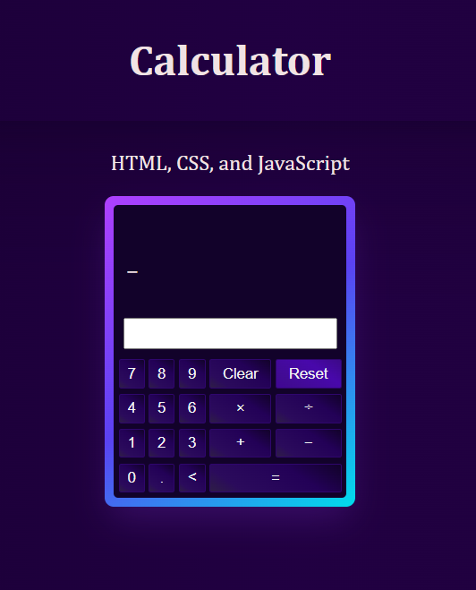

# Simple calculator for beginners

Beginner level - Calculator using HTML, CSS and JavaScript

This repository contains source code for a simple web based calculator, developed using HTML, CSS, JavaScript. The calculator does not support any complex calculations. It is limited to basic operations only with two operands.

> Beginners (or Students) who are learning web development can use this code for practice/reference purpose.

## Screenshots

